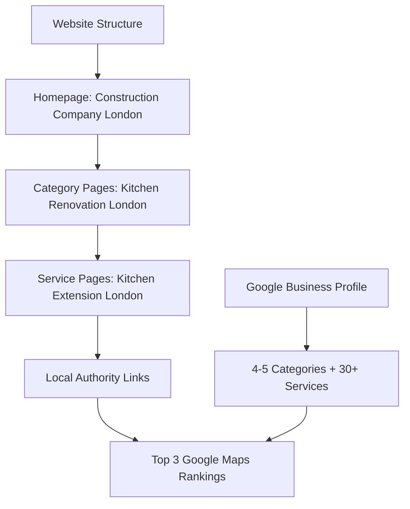

# Design Document

## Overview

The GBP (Google Business Profile) optimization system will implement a proven local SEO strategy to rank LiveBetterLife at the top of Google Maps within 30 days. This system focuses on optimizing the GBP listing with multiple categories and services, restructuring the website with location-based content, and building local authority through strategic link building.

## Architecture

### Proven Local SEO System



### Three-Pillar Strategy

1. **GBP Optimization**: Multiple categories, 30+ services, complete profile
2. **Website Structure**: Homepage → Category Pages → Service Pages with exact match keywords
3. **Local Authority**: Chamber of Commerce links and local citations

## Core Strategy Components

### 1. Google Business Profile Optimization

**Primary Category**: Construction Company
**Secondary Categories (4-5 total)**:
- House extensions
- Kitchen Renovator  
- Bathroom Renovator
- Building restoration service

**30+ Services to Add**:
- House extensions
- Structural alterations
- Building renovations
- Load-bearing wall removal
- Basement conversion
- Garage conversion
- Double storey extension
- Loft conversion
- Full house renovation
- Internal wall removal
- Steel beam installation
- Single storey rear extension
- Complete kitchen renovation
- Kitchen extension
- Kitchen island installation
- Kitchen cabinet replacement
- Quartz worktop installation
- Kitchen plumbing relocation
- Complete bathroom renovation
- Wet room conversion
- En-suite bathroom creation
- Walk-in shower installation
- Bathroom suite replacement
- Underfloor heating installation
- Victorian house restoration
- Period property renovation
- Listed building restoration
- Sash window restoration
- Heritage building renovation
- Traditional building repair
- Plus additional specific services

### 2. Website Structure Strategy

**Homepage Optimization**:
- Title Tag: "Construction Company London | Home Extensions & Renovations | LiveBetterLife"
- H1: "Construction Company London"
- First paragraph: Immediately address "construction company London" keyword
- H2 tags for each secondary category
- Internal links to category pages

**Category Page Structure**:
- Kitchen Renovation London
- Bathroom Renovation London  
- House Extensions London
- Building Restoration London

**Service Page Structure** (30+ pages):
- Kitchen Extension London
- Bathroom Extension London
- Loft Conversion London
- Basement Conversion London
- Victorian House Restoration London
- [Each service + London]

## Implementation Components

### 1. Homepage Optimization

**Current Issue**: Title tag is likely "Home" or company name only
**Solution**: 
- Title Tag: "Construction Company London | Home Extensions & Renovations | LiveBetterLife"
- H1: "Construction Company London" 
- Meta Description: Include primary keyword and location
- First paragraph must mention "construction company London" in first 1-2 sentences

**Secondary Categories as H2 Tags**:
```typescript
const secondaryCategories = [
  {
    title: "Kitchen Renovation London",
    description: "Complete kitchen renovations and extensions across London...",
    link: "/kitchen-renovation-london"
  },
  {
    title: "Bathroom Renovation London", 
    description: "Full bathroom renovations and wet room conversions...",
    link: "/bathroom-renovation-london"
  },
  {
    title: "House Extensions London",
    description: "Single and double storey extensions throughout London...", 
    link: "/house-extensions-london"
  },
  {
    title: "Building Restoration London",
    description: "Victorian and period property restoration services...",
    link: "/building-restoration-london"
  }
];
```

### 2. Category Page Structure

**Template for Each Category Page**:
- URL: `/kitchen-renovation-london`
- Title Tag: "Kitchen Renovation London | Kitchen Extensions & Remodeling | LiveBetterLife"
- H1: "Kitchen Renovation London"
- Content: Few hundred words about kitchen renovation in London
- H2 tags for each related service
- Internal links to service pages

**Service Links Structure**:
```typescript
const kitchenServices = [
  "Kitchen Extension London",
  "Kitchen Island Installation London", 
  "Kitchen Cabinet Replacement London",
  "Quartz Worktop Installation London",
  "Kitchen Plumbing Relocation London"
];
```

### 3. Service Page Implementation

**Individual Service Pages** (30+ pages):
Each service gets its own page with:
- URL: `/kitchen-extension-london`
- Title Tag: "Kitchen Extension London | Professional Kitchen Extensions | LiveBetterLife"
- H1: "Kitchen Extension London"
- Content: Detailed content about that specific service in London
- Project examples from that service category
- Call-to-action for quotes

**Content Structure**:
```typescript
interface ServicePage {
  slug: string;
  title: string;
  h1: string;
  metaDescription: string;
  content: string;
  relatedProjects: Project[];
  serviceArea: string[];
  priceRange: string;
}
```

### 4. Local Authority Building

**Primary Strategy**: Chamber of Commerce Links
- Join London Chamber of Commerce (£200-300/year)
- Join local borough chambers (Chiswick, etc.)
- Each chamber link provides massive local authority

**Additional Local Links**:
- Local sponsorship opportunities
- Youth sports teams sponsorship
- Community events sponsorship  
- Local charity partnerships
- Local business directories

**Target**: 5-10 high-quality local links across the site

### 5. Technical Implementation

**Schema Markup**:
```typescript
const businessSchema = {
  "@context": "https://schema.org",
  "@type": "HomeAndConstructionBusiness",
  "name": "LiveBetterLife",
  "description": "Professional construction company in London specializing in home extensions, kitchen renovations, and building restoration",
  "url": "https://livebetterlife.co.uk",
  "telephone": "+44 20 XXXX XXXX",
  "address": {
    "@type": "PostalAddress",
    "streetAddress": "[Your Address]",
    "addressLocality": "London", 
    "postalCode": "[Postcode]",
    "addressCountry": "UK"
  },
  "areaServed": ["London", "Chiswick", "Mayfair", "Westminster"],
  "priceRange": "£££"
};
```

**Image Optimization**:
- Alt text: "Kitchen extension London W4 - before renovation"
- File names: "kitchen-extension-chiswick-w4-before.jpg"
- Proper compression and sizing
- Location-specific image descriptions

### 6. Content Generation Strategy

**AI Prompts for Content Creation**:
Use AI to generate content for all 40+ pages following this structure:
- Homepage content with primary keyword
- Category page content (4 pages)
- Service page content (30+ pages)
- Each page optimized for specific keyword + London

**Content Requirements**:
- Natural keyword integration
- Location-specific information
- Service details and benefits
- Call-to-action sections
- Internal linking structure

## Data Models

### Website Structure Configuration

#### Site Structure
```typescript
interface SiteStructure {
  homepage: {
    title: "Construction Company London | Home Extensions & Renovations | LiveBetterLife";
    h1: "Construction Company London";
    targetKeyword: "construction company london";
  };
  categories: CategoryPage[];
  services: ServicePage[];
}

interface CategoryPage {
  slug: string;
  title: string;
  h1: string;
  targetKeyword: string;
  services: string[];
}

interface ServicePage {
  slug: string;
  title: string; 
  h1: string;
  targetKeyword: string;
  category: string;
  content: string;
}
```

#### GBP Configuration
```typescript
interface GBPConfig {
  primaryCategory: "Construction Company";
  secondaryCategories: [
    "House extensions",
    "Kitchen Renovator", 
    "Bathroom Renovator",
    "Building restoration service"
  ];
  services: string[]; // 30+ services
  businessInfo: {
    name: "LiveBetterLife";
    description: string;
    phone: string;
    address: string;
    website: "https://livebetterlife.co.uk";
  };
}
```

### Content Templates

#### Homepage Template
```typescript
const homepageTemplate = {
  title: "Construction Company London | Home Extensions & Renovations | LiveBetterLife",
  h1: "Construction Company London",
  intro: "LiveBetterLife is a leading construction company in London, specializing in home extensions, kitchen renovations, and building restoration across all London boroughs.",
  sections: [
    {
      h2: "Kitchen Renovation London",
      content: "Complete kitchen renovations and extensions...",
      link: "/kitchen-renovation-london"
    },
    {
      h2: "Bathroom Renovation London", 
      content: "Full bathroom renovations and wet room conversions...",
      link: "/bathroom-renovation-london"
    }
    // Additional sections...
  ]
};
```

#### Service Page Template
```typescript
const servicePageTemplate = {
  title: "{Service} London | Professional {Service} | LiveBetterLife",
  h1: "{Service} London", 
  content: `
    Professional {service} services across London. LiveBetterLife provides expert {service} 
    solutions for residential and commercial properties throughout London boroughs.
    
    Our {service} process includes:
    - Initial consultation and design
    - Planning and permits
    - Professional installation
    - Quality assurance and cleanup
    
    Service areas: London, Chiswick, Mayfair, Westminster, and surrounding areas.
  `,
  cta: "Get a free quote for your {service} project in London"
};
```

## Error Handling

### SEO Validation

1. **Schema Validation**: Ensure structured data is valid
2. **Content Quality**: Check for duplicate content and keyword stuffing
3. **Image Optimization**: Validate alt text and file sizes
4. **Link Validation**: Ensure internal links work correctly

### Fallback Strategies

1. **Missing Data**: Provide default values for required schema fields
2. **Image Loading**: Graceful fallbacks for missing images
3. **Location Data**: Default to main business location if specific area unavailable
4. **Review Display**: Handle cases where reviews are unavailable

### Performance Monitoring

**SEO Metrics to Track**:
- Page load speeds
- Core Web Vitals scores
- Schema markup validation
- Local search ranking positions
- Click-through rates from search results

**Content Quality Metrics**:
- Keyword density and distribution
- Content uniqueness scores
- Image optimization levels
- Internal linking structure

## Testing Strategy

### SEO Testing
- **Framework**: Jest with React Testing Library
- **Coverage**: Focus on SEO components and structured data
- **Focus Areas**: Schema markup generation, meta tag creation, content optimization

### Schema Validation Testing
- **Google's Structured Data Testing Tool**: Validate JSON-LD markup
- **Rich Results Test**: Check for rich snippet eligibility
- **Local Business Markup**: Verify local business schema accuracy

### Performance Testing
- **Lighthouse Audits**: Regular SEO and performance scoring
- **Core Web Vitals**: Monitor loading, interactivity, and visual stability
- **Mobile Optimization**: Test responsive design and mobile performance

### Content Quality Testing
- **Keyword Analysis**: Verify proper keyword integration
- **Duplicate Content**: Check for content uniqueness
- **Local SEO**: Test location-specific content accuracy

## Security Considerations

### Data Privacy
- Ensure customer project images have proper permissions
- Implement privacy controls for sensitive project information
- Comply with GDPR for customer data handling

### Content Security
- Validate user-generated content before display
- Implement proper image optimization without quality loss
- Secure handling of business contact information

### SEO Best Practices
- Avoid black-hat SEO techniques
- Ensure natural keyword integration
- Maintain content quality and relevance

## 30-Day Implementation Timeline

### Days 1-3: GBP Optimization
- Access and optimize Google Business Profile
- Add 4-5 categories (Construction Company + 4 secondary)
- List 30+ services
- Fill out every single field in GBP
- Schedule 52 weekly posts (entire year)
- **Time Required**: 30 minutes with AI assistance

### Days 4-10: Website Structure Setup
- Map out complete website structure
- Create sitemap with homepage, category pages, service pages
- Set up all URLs and page skeletons
- Plan internal linking structure
- **Result**: ~40 pages planned and structured

### Days 11-20: Content Creation
- Use AI to generate content for all pages
- Optimize title tags, H1s, H2s for each page
- Implement internal linking structure
- Add location-specific project images
- Review and edit AI content for natural flow
- **Focus**: Exact match keywords + London for each page

### Days 21-25: External Validation
- Join London Chamber of Commerce
- Set up local business citations
- Begin acquiring additional local links
- Submit sitemap to Google Search Console
- **Target**: 5-10 quality local authority links

### Days 26-30: Technical Optimization
- Add schema markup to all pages
- Optimize images with location keywords
- Ensure mobile responsiveness
- Check site loading speed
- Validate structured data with Google's tools

## Expected Results

### 30-Day Targets
- **Top 3 Google Maps ranking** for "construction company London"
- **Significant improvement** in local search visibility
- **Increased qualified leads** from local searches
- **Better search result snippets** with rich data

### Success Metrics
- Google Maps ranking position (target: top 3)
- Local search traffic increase
- Phone calls and contact form submissions
- Click-through rates from search results
- Rich snippet appearances in search results

## Why This System Works

### Competitive Advantage
- **60% of competitors** have "Home" as title tag
- **Most competitors** don't use multiple GBP categories
- **Few competitors** have proper internal linking structure
- **Limited competition** for specific service + location keywords

### Google Algorithm Alignment
- **Topical Relevance**: Comprehensive service coverage
- **Geographic Relevance**: Location-specific content structure  
- **Trust Signals**: Local authority links and citations
- **User Experience**: Fast, mobile-optimized site structure